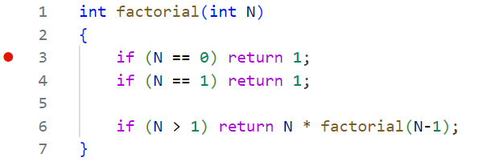
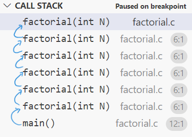
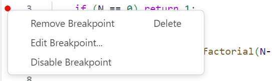

# Lab week 5
Objectives:
- Array and pointer
- Linked list
- Binary tree


## Review of last week
- Debugging using visual studio code (break points, conditional break points, callstack)

- Debug two source files [factorial.c](factorial.c) and [fibonacci.c](fibonacci.c)

1. Set break point

2. Run debug and check the call stack

3. Continue 
4. Move forward and backward using call stack
5. Use debugger and view the result of count function calls in [fibonacci.c](fibonacci.c). This is also an example of using variable in global scope. 

- Debug breakpoint with condition

Right click at the breakpoint and select "Edit Breakpoint"


## Problem 1: 
- Assign pointers 
- Passing pointers to function

### Exercise 1.1:
- Reverse an array by swapping elements.
- Note for swap function: read 5.2 Pointers and Function Arguments
- Write your implementation on [reverse_array.c](reverse_array.c)

### Exercise 1.2: Bubble sort
- Read the algorithm here 
https://www.programiz.com/dsa/bubble-sort
- Write your implementation on [bubble_sort.c](bubble_sort.c)

## Problem 2: Linked list
- Linked list https://www.tutorialspoint.com/data_structures_algorithms/linked_list_algorithms.htm

### Exercise 2.1:
- Create linked list from data array
[linked_list.c](linked_list.c)
- Complete the function

`void push_back(struct Node * head, int data)`

### Exercise 2.2
- Traverse and get all data from a linked list
- Complete the function

`int * getData(struct Node *)`

- Reference of realloc function
https://www.tutorialspoint.com/c_standard_library/c_function_realloc.htm

## Problem 3: Manually build a binary tree
- Reference: Binary search tree https://www.geeksforgeeks.org/insertion-in-binary-search-tree/

- Complete the code in [binary_search_tree.c](binary_search_tree.c) to build the following tree.

```  
             50
           /     \
          30      70
         /  \    /  \
       20   40  60   80 
```
- Pseudo code:

```
root = create_node(50)
root->left = create_node(30)
root->right = create_node(70)
root->left->left = create_node(20)
...
```

- Complete the function to free memory allocated for the binary tree.


